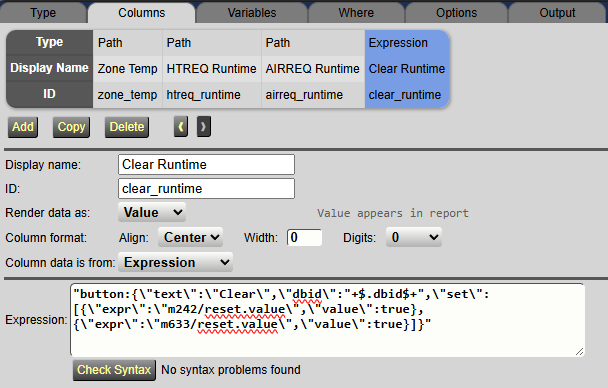
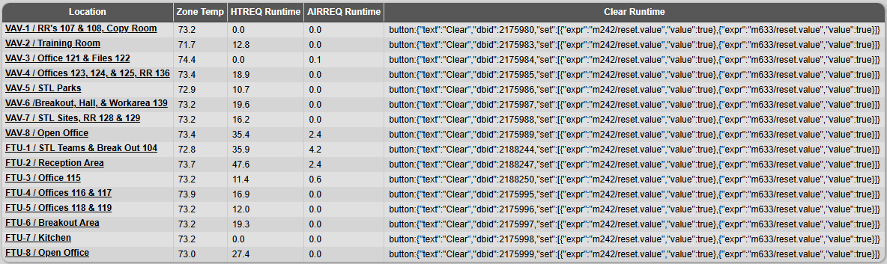
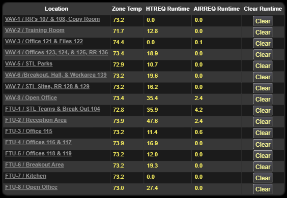

# Data Table Button

When you embed a WebCTRL report into a *.view* graphic using a data table control, [this script](./script.html) allows you to dynamically replace certain placeholder values in the report with a button that can modify WebCTRL node values.

## Usage

Ensure the [Rest API add-on](https://github.com/automatic-controls/rest-api-addon) is installed. Create a report where some of the column values resolve to a JSON object with `button:` as a prefix. The JSON object should follow this format:

```json
{
  "text": "Clear",
  "dbid": 2175980,
  "set": [
    {
      "expr": "m242/reset.value",
      "value": true
    },
    {
      "expr": "m633/reset.value",
      "value": true
    }
  ]
}
```

The DBID specifies which node in WebCTRL that the expressions should be resolved against. The text specifies the button text to be displayed on your graphic. You can have as many expressions in the `set` array as you would like. The values can be booleans, strings, or numbers. When the button is clicked, it will attempt to set each node expression to the provided value. If a node expression cannot be resolved for a particular location, then it will be ignored. To generate this object in a report, you could use a column definition like:

```
"button:{\"text\":\"Clear\",\"dbid\":"+$.dbid$+",\"set\":[{\"expr\":\"m242/reset.value\",\"value\":true},{\"expr\":\"m633/reset.value\",\"value\":true}]}"
```





Next, you should paste the contents of [script.html](./script.html) into a HTML content control in the same graphic as your data table. Feel free to make the HTML content control a tiny box in the corner because it will not render any content in of itself. It merely modifies the existing data table. When you view the graphic in WebCTRL, you should see buttons in the place of the json objects.



When you click a button, if any node expression cannot be resolved, a message will be printed to the debug console of your browser.